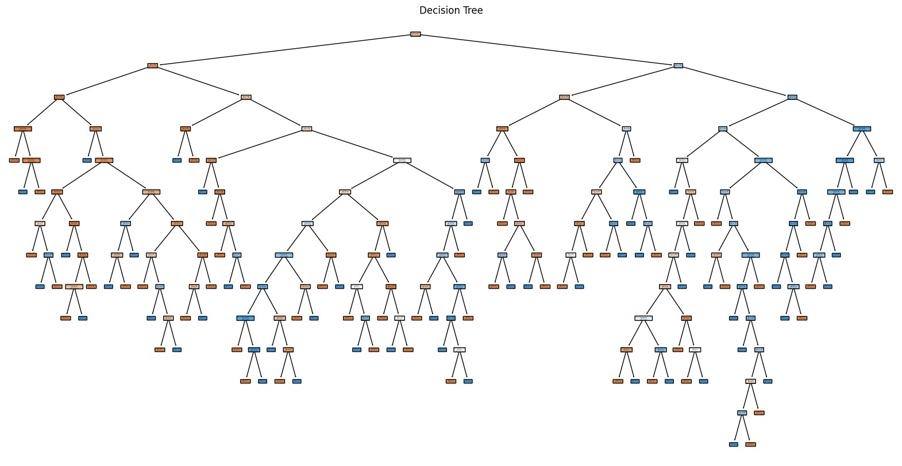

# Diabetes prediction using Decision Tree Algorithm, Worachat Wannawong, Ph.D. 2024

# Dataset

Here's a comprehensive `README.md` file for your `Diabetes_Prediction_Decision_Tree.ipynb` project. This README covers the project overview, requirements, instructions for running the notebook, and references to academic publications that underpin the methods used.

```markdown

# Diabetes Prediction Using Decision Tree

This project demonstrates the use of a Decision Tree Classifier to predict diabetes based on medical diagnostic measurements. It includes data exploration, multiple visualizations, and model evaluation to provide a comprehensive analysis of the dataset.

## Table of Contents

- [Overview](#overview)
- [Features](#features)
- [Installation](#installation)
- [Usage](#usage)
- [Visualizations](#visualizations)
- [Model Evaluation](#model-evaluation)
- [References](#references)

## Overview

The goal of this project is to predict the occurrence of diabetes in patients using a decision tree classifier. The dataset used contains various medical attributes such as glucose level, blood pressure, and age. The project involves data cleaning, visualization, model training, and evaluation.

## Features

- **Data Exploration**: Check for missing values and summarize dataset statistics.
- **Data Visualization**: Scatter plots, histograms, bar plots, boxplots, and correlation heatmaps.
- **Model Training**: Use a Decision Tree Classifier to build the model.
- **Model Evaluation**: Evaluate the model using accuracy, confusion matrix, and classification report.
- **Tree Visualization**: Visual representation of the decision tree.

## Installation

### Prerequisites

- Python 3.6+
- Jupyter Notebook

### Python Libraries

Install the required Python libraries using `pip`:

```bash
pip install pandas matplotlib seaborn scikit-learn
```

## Usage

1. **Clone the Repository**:

   ```bash
   git clone https://github.com/yourusername/diabetes-prediction-decision-tree.git
   cd diabetes-prediction-decision-tree
   ```

2. **Open Jupyter Notebook**:

   ```bash
   jupyter notebook Diabetes_Prediction_Decision_Tree.ipynb
   ```

3. **Run the Notebook**: Execute the cells in the notebook sequentially to load the data, visualize it, and train the model.

## Visualizations

The notebook includes several visualizations to explore and understand the dataset:

1. **Scatter Plot of Pregnancies vs Glucose**:
   

2. **Histogram of Blood Pressure**:
   

3. **Bar Plot of Mean Skin Thickness by Outcome**:
   

4. **Boxplot of Age by Outcome**:
   

5. **Correlation Heatmap**:
   

6. **Decision Tree Visualization**:
   

## Model Evaluation

The model's performance is evaluated using:

- **Accuracy**: The percentage of correct predictions.
- **Confusion Matrix**: A table showing the performance of the classifier.
- **Classification Report**: Detailed metrics including precision, recall, and F1-score.

### Example Outputs

- **Accuracy**: `0.77`
- **Confusion Matrix**:
  ```
  [[85 14]
   [21 34]]
  ```
- **Classification Report**:
  ```
               precision    recall  f1-score   support
           0       0.80      0.86      0.83        99
           1       0.71      0.62      0.67        55
    accuracy                           0.77       154
   macro avg       0.76      0.74      0.75       154
weighted avg       0.77      0.77      0.77       154
  ```

## References

The methods and techniques used in this project are based on the following academic publications:

1. **Decision Trees in Machine Learning**
   - Quinlan, J. R. (1986). *Induction of decision trees*. Machine Learning, 1(1), 81-106.
     - **DOI**: [10.1007/BF00116251](https://doi.org/10.1007/BF00116251)

2. **Evaluation Metrics for Classification**
   - Fawcett, T. (2006). *An introduction to ROC analysis*. Pattern Recognition Letters, 27(8), 861-874.
     - **DOI**: [10.1016/j.patrec.2005.10.010](https://doi.org/10.1016/j.patrec.2005.10.010)

3. **Data Visualization in Statistical Analysis**
   - Tufte, E. R. (2001). *The Visual Display of Quantitative Information*. Cheshire, CT: Graphics Press.
     - **ISBN**: 0961392142

4. **Heatmaps for Data Correlation Visualization**
   - Wilkinson, L., & Friendly, M. (2009). *The history of the cluster heat map*. The American Statistician, 63(2), 179-184.
     - **DOI**: [10.1198/tas.2009.0033](https://doi.org/10.1198/tas.2009.0033)

5. **Overview of Machine Learning Techniques for Medical Data**
   - Kourou, K., Exarchos, T. P., Exarchos, K. P., Karamouzis, M. V., & Fotiadis, D. I. (2015). *Machine learning applications in cancer prognosis and prediction*. Computational and Structural Biotechnology Journal, 13, 8-17.
     - **DOI**: [10.1016/j.csbj.2014.11.005](https://doi.org/10.1016/j.csbj.2014.11.005)

---

Feel free to contribute or report any issues. Happy analyzing!
```

### Key Components of the README:

- **Overview**: Brief introduction to the project.
- **Features**: Lists the key functionalities of the notebook.
- **Installation**: Instructions on how to set up the environment.
- **Usage**: Steps to run the notebook.
- **Visualizations**: Descriptions and example images of the visualizations (placeholders for where the actual images should be).
- **Model Evaluation**: Sample outputs for model evaluation metrics.
- **References**: Academic sources supporting the methods used.

This README provides a detailed guide for users to understand, set up, and run your project while giving them insights into the visualizations and model evaluation methods used. Feel free to adjust the content or formatting to better fit your project.
